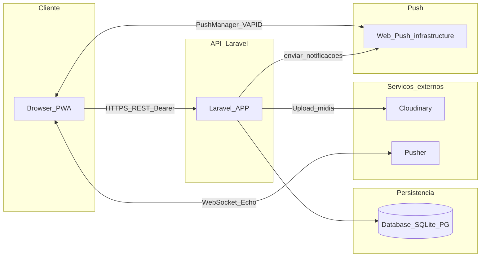
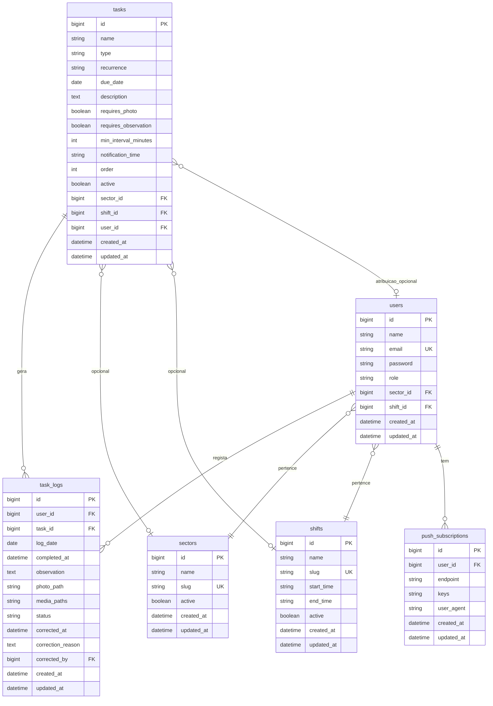
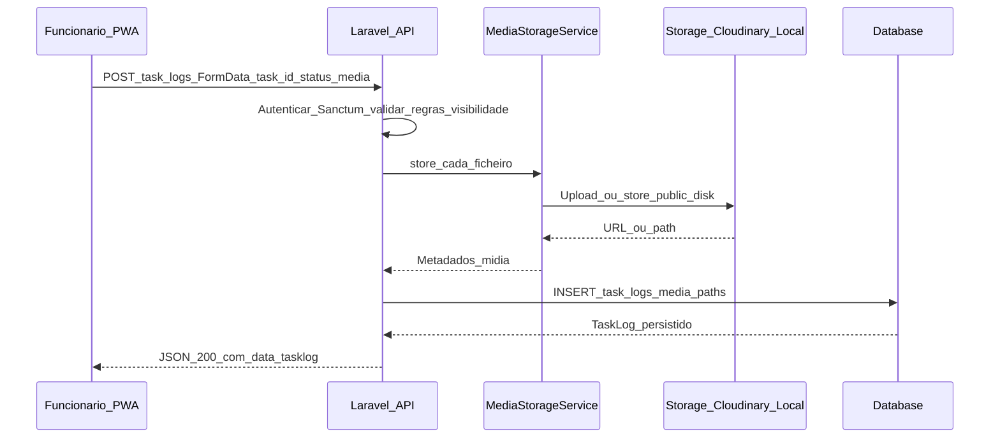
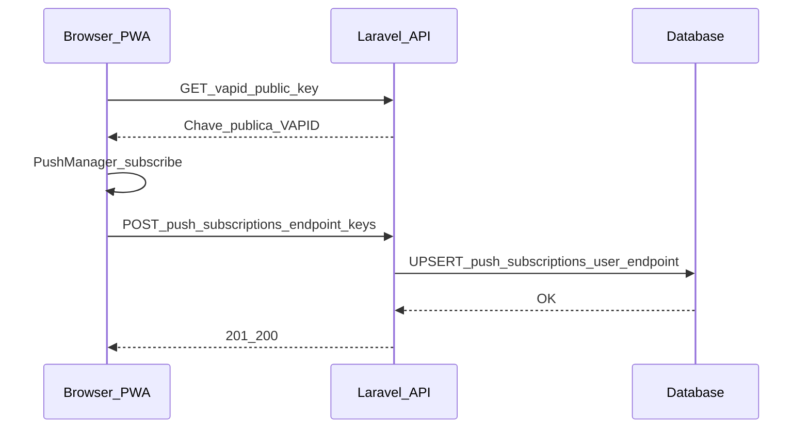

# Modelo de dados e diagramas — Tasks POP

Este documento descreve as **entidades persistidas**, atributos principais, relacionamentos e diagramas em [Mermaid](https://mermaid.js.org/). Para regras de negócio e casos de uso, ver [requisitos-e-casos-de-uso.md](requisitos-e-casos-de-uso.md).

---

## 1. Diagrama de contexto do sistema

Vislumbre dos componentes externos e do backend.

- **Cloudinary**: opcional em produção para armazenar mídia de comprovantes; fallback em disco `public` local.
- **Pusher**: tempo real na interface (ex.: atualização de logs); independente de Web Push no dispositivo.
- **Web Push**: serviços do browser/provedor de push; a API guarda subscrições e dispara notificações conforme jobs/agendamento.

---

## 2. Diagrama entidade-relacionamento (domínio principal)

**Nota:** `personal_access_tokens` (Sanctum) existe na base de dados para tokens API; não aparece no ER de negócio acima. Ver migration em `api/database/migrations/`.

---

## 3. Entidades e tabelas

### 3.1 `users`

Utilizador autenticável (funcionário ou gerente).

| Atributo (lógico) | Descrição |
|-------------------|-----------|
| `id` | Chave primária |
| `name`, `email` | Identificação; email único |
| `password` | Armazenado com hash (cast Eloquent) |
| `role` | `employee` \| `manager` |
| `sector_id`, `shift_id` | Opcionais; escopo operacional do funcionário |
| `email_verified_at` | Opcional (ver migration users) |

**Relacionamentos:** `belongsTo` Sector, Shift; `hasMany` TaskLog; `hasMany` PushSubscription (via modelo).

---

### 3.2 `sectors`

Setor operacional (ex.: produção, copa).

| Atributo | Descrição |
|----------|------------|
| `name`, `slug` | Nome e identificador URL único |
| `active` | Ativo/inativo |

---

### 3.3 `shifts`

Turno de trabalho.

| Atributo | Descrição |
|----------|------------|
| `name`, `slug` | Nome e identificador único |
| `start_time`, `end_time` | Janela opcional |
| `active` | Ativo/inativo |

---

### 3.4 `tasks`

Definição de tarefa POP (diária, semanal, etc.).

| Atributo | Descrição |
|----------|------------|
| `name`, `type`, `recurrence` | Nome; `type` herdado do domínio; `recurrence`: single, daily, weekly, monthly |
| `due_date` | Para tarefas pontuais (`single`) |
| `description` | Texto livre |
| `requires_photo`, `requires_observation` | Obrigatoriedade de mídia e observação |
| `min_interval_minutes` | Intervalo mínimo entre conclusões (regra de produto) |
| `notification_time` | Hora sugerida para lembrete (integração com notificações) |
| `order` | Ordenação na UI |
| `active` | Tarefa visível ou não |
| `sector_id`, `shift_id` | `null` = aplica a todos os setores/turnos elegíveis |
| `user_id` | Atribuição opcional a um utilizador específico |

**Relacionamentos:** `hasMany` TaskLog; `belongsTo` Sector, Shift, User (opcional).

---

### 3.5 `task_logs`

Registo diário (por utilizador e tarefa) de execução.

| Atributo | Descrição |
|----------|------------|
| `user_id`, `task_id`, `log_date` | Unicidade composta `(user_id, task_id, log_date)` |
| `completed_at` | Momento da conclusão, se aplicável |
| `observation` | Texto livre |
| `photo_path` | Legado; primeira mídia ou URL única legada |
| `media_paths` | JSON: array de objetos com `url` e `type` (`image` \| `video`) |
| `status` | `pending`, `completed`, `corrected` (e variantes usadas na API) |
| `corrected_at`, `correction_reason`, `corrected_by` | Rastreio de correção pelo gerente |

**Relacionamentos:** `belongsTo` User, Task; `belongsTo` User `correctedByUser`.

---

### 3.6 `push_subscriptions`

Subscrição Web Push de um utilizador (endpoint + chaves).

| Atributo | Descrição |
|----------|------------|
| `user_id` | Dono da subscrição |
| `endpoint` | URL do serviço de push |
| `keys` | JSON (`p256dh`, `auth`) |
| `user_agent` | Opcional, para diagnóstico |

**Restrição:** único por `(user_id, endpoint)`.

---

## 4. Diagrama de sequência — Concluir tarefa com mídia (online)

Fluxo simplificado: cliente autenticado envia `multipart/form-data` e a API persiste mídia (Cloudinary ou disco `public`).

---

## 5. Diagrama de sequência — Registar subscrição Web Push

---

## 6. Referências no código

- Models Eloquent: [`api/app/Models/`](../api/app/Models/)
- Migrations: [`api/database/migrations/`](../api/database/migrations/)
- Visibilidade de tarefas / logs: [`api/app/Services/TaskVisibilityService.php`](../api/app/Services/TaskVisibilityService.php)

---

*Última atualização: alinhado às migrations e models do repositório `api/`.*
